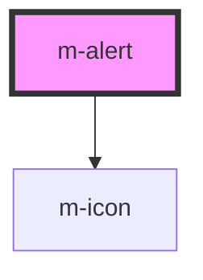

# m-alert

<!-- Auto Generated Below -->

## Properties

| Property | Attribute | Description | Type                                                     | Default     |
| -------- | --------- | ----------- | -------------------------------------------------------- | ----------- |
| `close`  | `close`   |             | `boolean`                                                | `false`     |
| `icon`   | `icon`    |             | `string`                                                 | `undefined` |
| `type`   | `type`    |             | `"danger" \| "default" \| "info" \| "success" \| "warn"` | `'default'` |

## Dependencies

### Depends on

- [m-icon](../m-icon)

### Graph

----------------------------------------------

*Built with [StencilJS](https://stenciljs.com/)*
