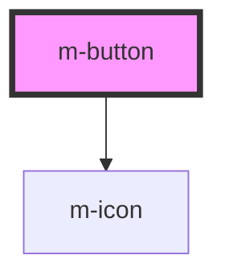

# m-button

<!-- Auto Generated Below -->

## Properties

| Property   | Attribute  | Description | Type                                                    | Default     |
| ---------- | ---------- | ----------- | ------------------------------------------------------- | ----------- |
| `color`    | `color`    |             | `"danger" \| "primary" \| "success" \| "warn"`          | `undefined` |
| `disabled` | `disabled` |             | `boolean`                                               | `undefined` |
| `href`     | `href`     |             | `string`                                                | `undefined` |
| `icon`     | `icon`     |             | `string`                                                | `undefined` |
| `loading`  | `loading`  |             | `boolean`                                               | `undefined` |
| `type`     | `type`     |             | `"dashed" \| "flat" \| "hollow" \| "primary" \| "text"` | `'primary'` |

## Dependencies

### Depends on

- [m-icon](../m-icon)

### Graph

----------------------------------------------

*Built with [StencilJS](https://stenciljs.com/)*
