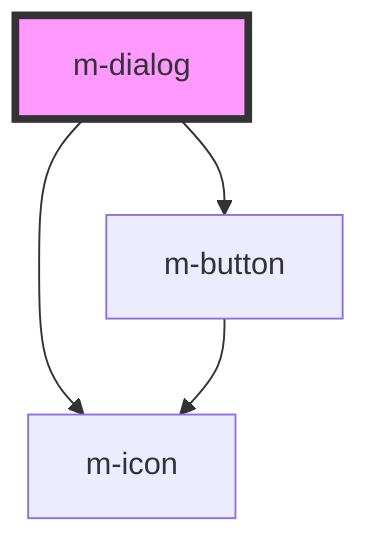

# m-dialog

<!-- Auto Generated Below -->

## Properties

| Property  | Attribute | Description | Type                                     | Default                           |
| --------- | --------- | ----------- | ---------------------------------------- | --------------------------------- |
| `actions` | --        |             | `{ cancel?: string; confirm?: string; }` | `{ cancel: '关闭', confirm: '提交' }` |
| `content` | `content` |             | `string`                                 | `undefined`                       |
| `icon`    | `icon`    |             | `string`                                 | `undefined`                       |
| `name`    | `name`    |             | `string`                                 | `'标题'`                            |
| `type`    | `type`    |             | `any`                                    | `undefined`                       |

## Methods

### `destroy() => Promise<void>`

#### Returns

Type: `Promise<void>`

## Dependencies

### Depends on

- [m-icon](../m-icon)
- [m-button](../m-button)

### Graph

----------------------------------------------

*Built with [StencilJS](https://stenciljs.com/)*
