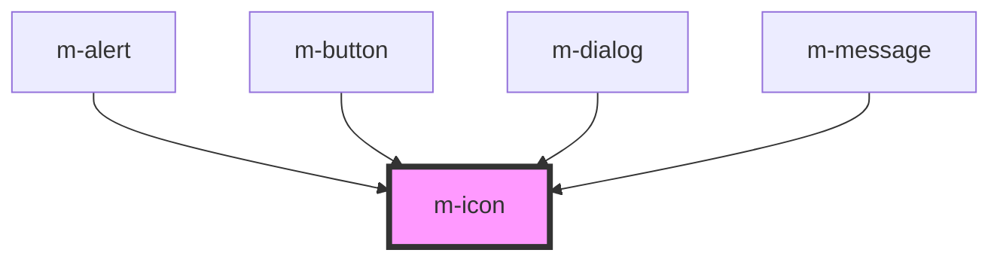

# m-icon

<!-- Auto Generated Below -->

## Properties

| Property            | Attribute    | Description | Type               | Default     |
| ------------------- | ------------ | ----------- | ------------------ | ----------- |
| `color`             | `color`      |             | `string`           | `'#333'`    |
| `fill`              | `fill`       |             | `string`           | `'none'`    |
| `icon` _(required)_ | `icon`       |             | `string`           | `undefined` |
| `iconWidth`         | `icon-width` |             | `number`           | `1`         |
| `size`              | `size`       |             | `number \| string` | `'14px'`    |

## Dependencies

### Used by

 - [m-alert](../m-alert)
 - [m-button](../m-button)
 - [m-dialog](../m-dialog)
 - [m-message](../m-message)

### Graph

----------------------------------------------

*Built with [StencilJS](https://stenciljs.com/)*
