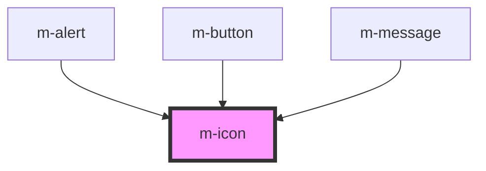

# m-icon

<!-- Auto Generated Below -->

## Properties

| Property    | Attribute    | Description | Type               | Default     |
| ----------- | ------------ | ----------- | ------------------ | ----------- |
| `color`     | `color`      |             | `string`           | `'#FFF'`    |
| `icon`      | `icon`       |             | `string`           | `undefined` |
| `iconWidth` | `icon-width` |             | `number`           | `1`         |
| `size`      | `size`       |             | `number \| string` | `14`        |

## Dependencies

### Used by

 - [m-alert](../m-alert)
 - [m-button](../m-button)
 - [m-message](../m-message)

### Graph

----------------------------------------------

*Built with [StencilJS](https://stenciljs.com/)*
