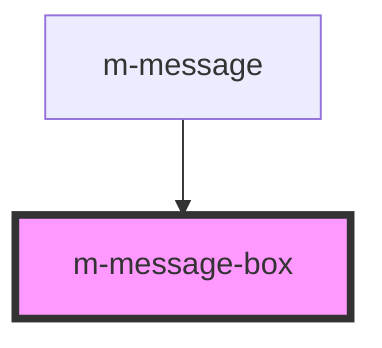

# m-message

<!-- Auto Generated Below -->

## Dependencies

### Used by

 - [m-message](.)

### Graph

----------------------------------------------

*Built with [StencilJS](https://stenciljs.com/)*
