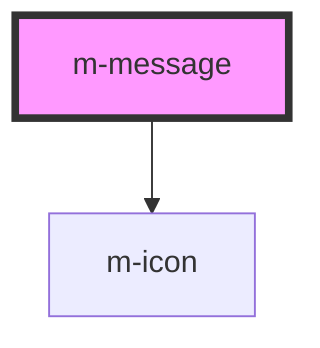

# m-message

<!-- Auto Generated Below -->

## Properties

| Property    | Attribute    | Description | Type      | Default     |
| ----------- | ------------ | ----------- | --------- | ----------- |
| `canDelete` | `can-delete` |             | `boolean` | `false`     |
| `icon`      | `icon`       |             | `string`  | `undefined` |
| `type`      | `type`       |             | `string`  | `'primary'` |

## Dependencies

### Depends on

- [m-icon](../m-icon)

### Graph

----------------------------------------------

*Built with [StencilJS](https://stenciljs.com/)*
